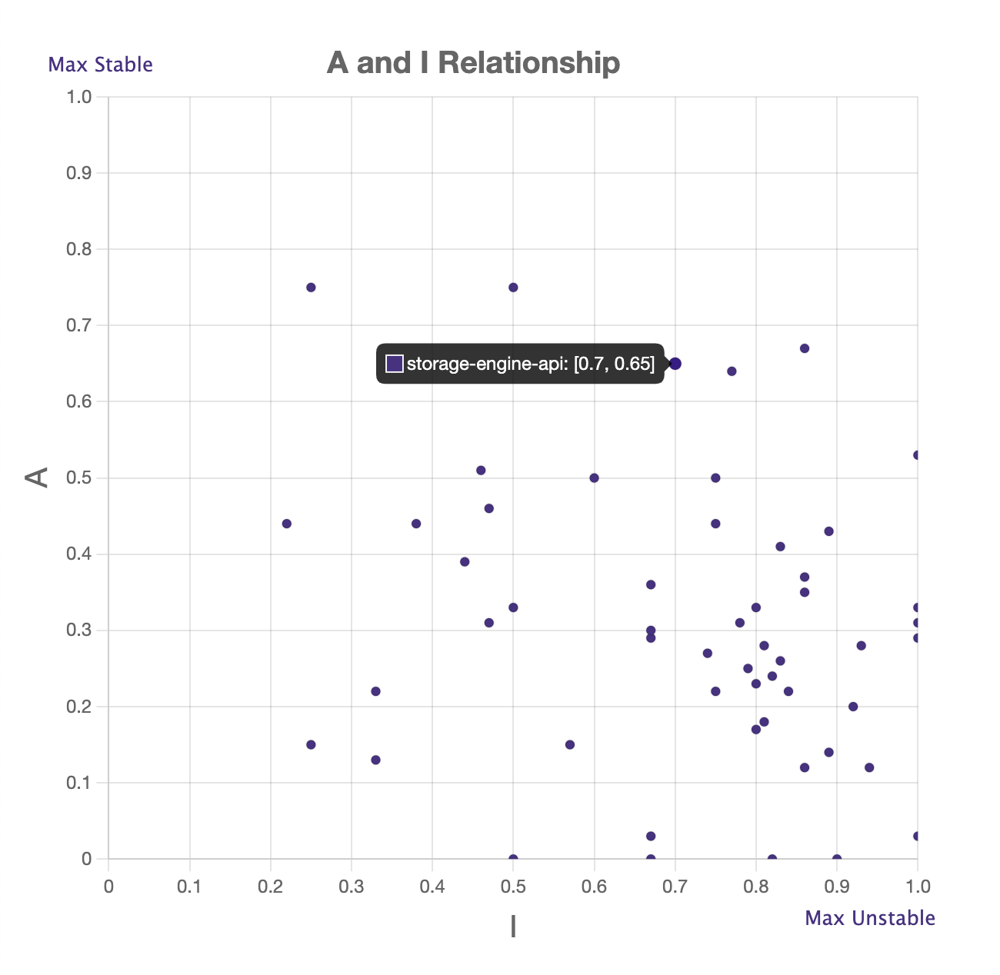

# Design Principles: Components

**Component Coupling Calculation:**

Calculate Instability and the Abstraction metrics for [Neo4J components][1] and analyze the structure of the system.
Neo4j has multiple components, therefore it may not be possible to analyze every single one of them. Analysis of 
at least 10 is required.

You can find dependencies by looking at pom file like [this][2]; `groupId` means namespace and `artifactId` is the
package name.

Build an I v/s A chart and plot each component on it based on the metrics calculated.

[1]: https://github.com/neo4j/neo4j/tree/4.4/community
[2]: https://github.com/neo4j/neo4j/blob/4.4/community/codegen/pom.xml

The POM file shows dependencies that the components need. So you can just add up all the dependencies there. The fan in
is a simple directory search of the component you are investigating in each component's pom files. You can do this in a
script (try grep) or this can be done in IDEs (limit to a directory and do regex search).
You do not need to go to each class within each component to find dependency. The POM files already declare the
dependencies for the entire component.

fanOut = number of dependencies of the target component (see dependencies list in its pom file)
fanIn = number of components which have the target component as their dependency (check each other component's pom file
if they contain the target component as dependency)

Instability = fanOut / (fanIn + fanOut)

I = 0 - Maximally stable: no dependencies [fanOut = 0]
I = 1 - Maximally unstable: no components depend on it [fanIn = 0]

Abstraction metrics:
Ratio of interfaces and abstract classes in a component to the total number of classes in the component. Ranges from 0 to 1. 
A = 0 => No abstract class
A = 1 => All abstract classes
